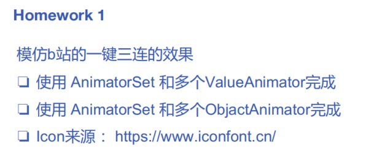
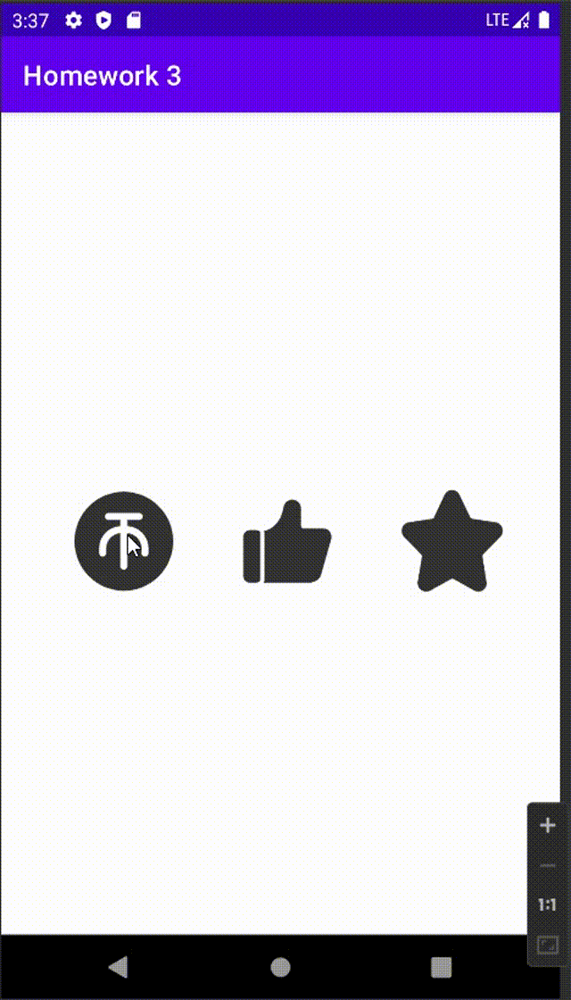

## Homework 3
#### 题目要求

#### 目录内容
- `app/src/main/java/com/crepuscule/sjtu/homework3/MainActivity`
- `app/src/main/res/drawable`
- `app/src/main/res/layout/activity_main.xml`

#### 实现效果

- 单击
  

  

- 长按
